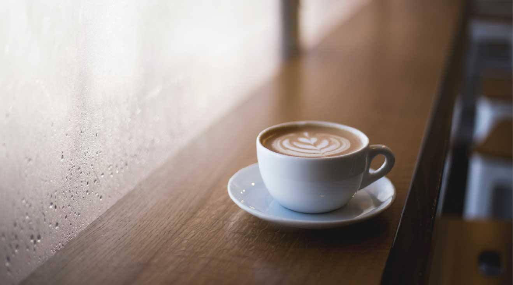

# DIC Coffee - Cafe Website

## Overview

DIC Coffee is a responsive static website for a cozy cafe specializing in natural organic coffee made from Rwandan \"DIC Beans\" and delicious pancakes like blueberry pancakes. Features a modern design with hero sections, concept highlights, menu showcases (pancakes and coffee), and a contact form with Google Maps integration.

Built as a frontend project by DIVE INTO CODE Corp. The site is in Japanese (lang=\"ja\") with English navigation elements.

 *(Example hero background)*

## Features

- **Home Page** (`index.html`): Hero with logo/navigation, Concept section explaining DIC Beans coffee, Recommended pancakes & coffee menu previews, Access info with map.
- **Menu Page** (`blueberry_pancakes.html`): Focuses on blueberry pancakes with side menu, related pancake listings, detailed description and pricing.
- **Contact Page** (`contact.html`): Contact form (name, phone, region select, message), styled table layout.
- Responsive design (media queries prepared in CSS).
- Global navigation and footer across pages.
- Google Fonts (Noto Serif JP) for elegant typography.
- Embedded Google Maps for location.

## Tech Stack

- **HTML5** (semantic elements, forms, iframes)
- **CSS3** (Flexbox, background images, responsive utilities)
  - Modular CSS: normalize, common, main, menu, contact.
- **Assets**: Optimized images for cafe theme (pancakes, coffee, concepts).
- No JavaScript or backend required – pure static site.

## Project Structure

\`\`\`
DIC coffee/
├── index.html              # Home page
├── blueberry_pancakes.html # Menu detail page
├── contact.html            # Contact form
├── css/
│   ├── nomalize.css       # Normalize (typo: should be normalize?)
│   ├── common.css
│   ├── main.css           # Core styles, hero, concept, menu
│   ├── menu.css
│   └── contact.css
└── images/                 # All assets (logo_k.png, logo_w.png, pancakes, coffee, etc.)
    ├── sample_logo_k.png
    ├── sample_logo_w.png
    ├── sample_key.jpg
    ├── sample_concept.jpg
    ├── sample_pancake1.jpg
    ├── sample_pancake2.jpg
    ├── sample_pancake3.jpg
    ├── sample_pancake4.jpg
    ├── sample_cafe1.jpg
    ├── sample_cafe2.jpg
    ├── sample_cafe3.jpg
    ├── sample_cafe4.jpg
    └── sample_menu_bg.jpg
\`\`\`

## Quick Start

1. Clone or download the project.
2. Open \`index.html\` in any modern browser:
   \`\`\`
   open index.html
   \`\`\`
3. Navigate via menu: Home, Menu (Blueberry Pancakes), Contact.

No build tools or servers needed – serves instantly!

## Screenshots

- **Home**: Hero \"DIC Coffee - natural organic coffee\", concept text + image, menu grids.
- **Menu**: Side nav, large pancake image, related items with buttons.
- **Contact**: Clean form table, submit/reset buttons.
